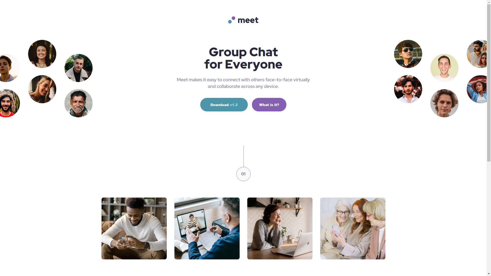

# Frontend Mentor - Meet landing page solution

This is a solution to the [Meet landing page challenge on Frontend Mentor](https://www.frontendmentor.io/challenges/meet-landing-page-rbTDS6OUR). Frontend Mentor challenges help you improve your coding skills by building realistic projects.

## The challenge

Users should be able to:

- View the optimal layout depending on their device's screen size
- See hover states for interactive elements

## Screenshot

## Links

- [Solution](https://www.frontendmentor.io/solutions/mobilefirst-scss-r6POkKFLbI)
- [Live Site](https://frontend-mentor-meet-26071997.netlify.app/)
